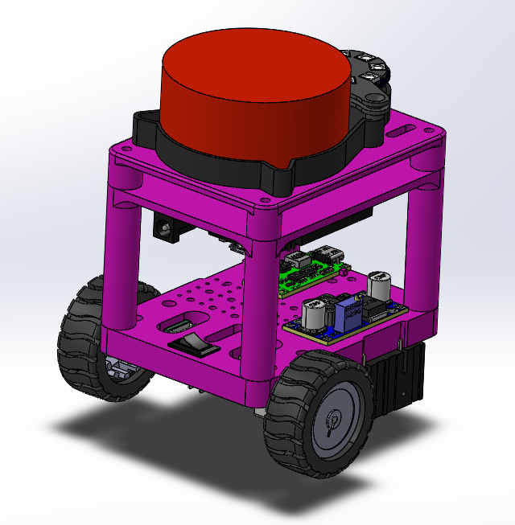

# ROSiK  
**Robot Operating System — interactive Kit**  


Мини-робот на **ESP32 Wroom-32 + ROS 2**, который:
* транслирует одометрию и лидар по Wi-Fi через WebSocket-мост;
* строит карты и локализуется (`slam_toolbox`);
* планирует путь (`nav2`);
* легко расширяется модулями — камера, IMU, динамик, адресные LED, OLED-дисплей.

Работает **на любой машине**: чистая Ubuntu 24.04, WSL 2 под Windows или виртуалка — нужен лишь Wi-Fi.

Инструкция по установке [Ubuntu](https://stepik.org/lesson/1505338/step/1?unit=1525484), [WSL](https://stepik.org/lesson/1505339/step/4?unit=1525485), а также  [запуску графический приложений (RVIZ](https://stepik.org/lesson/1505339/step/5?unit=1525485).


---

## 📑 Содержание
1. [Аппаратная часть (BOM)](#аппаратная-часть-bom)  
2. [Электрическая схема](#электрическая-схема)  
3. [3D-модели и сборка](#3d-модели-и-сборка)  
4. [Прошивка ESP32](#прошивка-esp32)
5. [Настройка PID и тестирование](#настройка-pid)
6. [Установка нод в ROS2](#установка-по-на-пк)  
7. [Запуск ROS 2-нод](#запуск-ros-2-нод)  
8. [Контакты](#контакты)


## 🛒<a id="аппаратная-часть-bom">Аппаратная часть (BOM)</a>

* | 1 | **ESP32 Wroom-32 DevKit**         | https://aliexpress.ru/item/1005006697750568.html
* | 2 | DC-мотор N20 60 RPM + энкодер     | https://aliexpress.ru/item/1005007145668771.html
* | 3 | Драйвер моторов ZK-5AD            | https://aliexpress.ru/item/1005005798367960.html
* | 4 | Лидар                             | https://aliexpress.ru/item/1005008371059417.html
* | 5 | Аккумулятор 18650 × 2 + держатель | https://aliexpress.ru/item/1005005447141518.html
* | 6 | Понижающий DC-DC                  | https://aliexpress.ru/item/32896699470.html
* | 7 | Переключатель питания             | https://aliexpress.ru/item/4000973563250.html
* | 8 | Type-C зарядка  2S 1A             | https://aliexpress.ru/item/1005006628986640.html


---

## 🔌 <a id="электрическая-схема">Электрическая схема</a>

Файл CorelDraw **`/Scheme/ROSik_scheme.cdr`**  
а также PNG **`/Scheme/scheme.png`**.  
В схеме показаны соединения питания (8,4 V → 5 V), сигнальные линии к драйверу моторов, энкодерам, лидару (UART)  


---

## 🖨 <a id="3d-модели-и-сборка">3D-модели и сборка</a>

Каталог **`/3D`** содержит файлы SolidWorks (`.SLDPRT/.SLDASM`) и готовые `.STL` для печати.


* | `00 - WheelLayer.*`    | Нижняя плита с моторами 
* | `01 - LidarLayer.*`    | Верхняя плита под лидар 
* | `10 - ESPLayer.*`      | Средняя плита под ESP32 и драйвер 
* | `Bracket.* / Holder.*` | Крепёж моторов, DC-DC и т.п. 
* | `RosikAssambl.SLDASM`  | Полная сборка 
* | `STL/`                 | Файлы для печати (0,2 мм, PLA) 
* | `ROSik.png`            | Рендер итогового вида 

Собирать снизу → вверх, фиксируя слои стойками M3 × 20 мм. Проводку прячем во внутреннем объеме робота.

---

## 🔥<a id="прошивка-esp32"> Прошивка ESP32 </a>

### Требуемые библиотеки (Arduino IDE)

* Скопируйте ZIP-файлы из `/esp32_libraries/` в `Documents/Arduino/libraries`  
* Добавьте плату ESP32: `File → Preferences → Additional URL` → `https://raw.githubusercontent.com/espressif/arduino-esp32/gh-pages/package_esp32_index.json`
* Через Board Manager добавьте ESP32

### Шаги прошивки

1. Откройте **`/esp32_firmware/esp32_firmware.ino`** в Arduino IDE.  
2. Измените SSID и пароль Wi-Fi сети.  
3. Порт: `Tools → Port → /dev/ttyUSB?` (или COM\*)
4. Плата: `ESP32 Wroom DA Module`
5. Загрузка `Ctrl + U`.  
6. После рестарта ESP32 печатает IP-адрес в Serial Monitor. Скорость: `115200 baud`.

> Прошивка для ESP32_cam (`/esp32_cam/firmware/firmware.ino`) 

---

## <a id="настройка-pid">Настройка PID и тестирование робота</a>

### Утилита позволив вам подобрать коэффициенты PID - регулятора и приверить его работу


* Измените IP адрес
* Проверьте работу обометрии и управления роботом
* Подберите коэффициенты и измените их в прошивке робота

---

## 🐧 Установка Ноды в ROS2

```bash
# 1. Создаём рабочую директорию
mkdir -p ~/ros2_ws/src && cd ~/ros2_ws/src

# 2. Копируем esp32_bridge в ~/ros2_ws/src

# 3. Сборка
cd ~/ros2_ws
colcon build
source install/setup.bash

````

* Все конфиги лежат в директории `esp32_bridge\config`. При запуске исправить пути к конфигам на актуальные
* протестировано на **ROS 2 Jazzy** (Ubuntu 24.04)
* в **WSL 2** нужен X-server (XLaunch) для RViz 2

---

## 🚀<a id="запуск-ros-2-нод"> Запуск ROS 2-нод </a>

| Шаг | Команда                                                                                                                     | Описание            |
| --- | --------------------------------------------------------------------------------------------------------------------------- | ------------------- |
| 1   | `ros2 run esp32_bridge esp32_bridge --ros-args -p host:=<IP_ESP32> `                                                        | WebSocket-мост      |
| 2   | `rviz2`  → `File → Open Config` → `config/rviz/rosik.rviz`                                                                  | Визуализация данных |
| 3   | `ros2 launch slam_toolbox online_sync_launch.py slam_params_file:=~/ros2_ws/src/esp32_bridge/config/slam_param.yaml`        | Онлайн SLAM         |
| 4   | `ros2 run teleop_twist_keyboard teleop_twist_keyboard`                                                                      | Телеуправление      |
| 5   | `ros2 service call /slam_toolbox/serialize_map slam_toolbox/srv/SerializePoseGraph "{filename: '~/ros2_ws/maps/my_map'}"`   | Сохранить карту     |
| 6   | `ros2 launch slam_toolbox localization_launch.py slam_params_file:=~/ros2_ws/src/esp32_bridge/config/slam_localization.yaml`| Локализация         |
| 7   | `ros2 launch nav2_bringup navigation_launch.py params_file:=~/ros2_ws/src/esp32_bridge/config/nav_param.yaml`               | Навигация `nav2`    |

> **WSL 2**: перед запуском RViz 2<br>
> `export DISPLAY=$(ip route | awk '/default/ {print $3}'):0.0` или
> `export DISPLAY=xxx.xxx.xxx.xxx:0.0`

Настройки RVIZ в файле `esp32_bridge/config/rviz.rviz`

---

* Telegram: **[@burmistrov\_robotics](https://t.me/burmistrov_robotics)**
* Stepik- Народный курс: [https://stepik.org/course/221157](https://stepik.org/course/221157)

---

